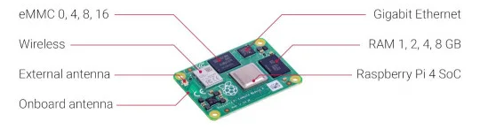
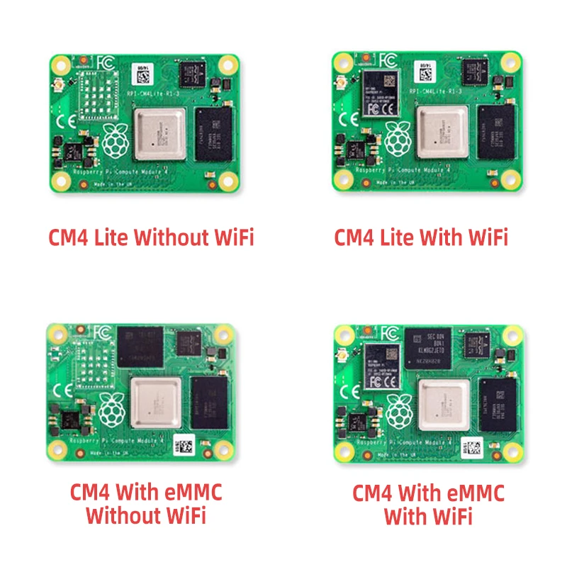

<p align="center"></p>
<h1 align="center">Raspberry Pi Compute Module 4 RPI CM4 Getting Started</h1> 
<h4 align="right">May 23</h4>


<br>

# RPI CM4
<p align="center"></p>
<p align="center"></p>


# Flashing RPi CM4 with eMMC on Windows 

> :warning: **Warning:** No funciona para RPi CM4 lite (no posee el eMMC), tiene otro procedimiento.
no se necesita una SD-ext en la placa base (se usa el eMMC).

## Pasos

1. Ponemos el swich Boot en On para que arranque desde USB (debe ser un OTG cable) 
2. Conectamos al PC (en Control Panel/System/bluetooth & Devices/ Devices encontraremos un dispositivo BCM2711 Boot, en Windows 11).
3. Instalar driver para la eMMC ```rpiboot```. Corre ```rpiboot``` desde el menu inicio de Windows si lo tienes instalado en tu Notebook, sino descarga desde aqui -->[rpiboot.exe](https://www.mediafire.com/file/bo6gg4sxd9rkk95/Rpiboot_setup.zip/file).

> :warning: **Warning:** Debes correrlo como administrator para instalar el driver. <br>
> :warning: **Warning:** Cada vez que se necesite tener acceso a la eMMC para instalar un OS o leer la SD se debe correr  la App desde el menu de inicio de Windows, este detectara la eMMC y pedira formatearla, solo asi el ```Raspberry Pi Imager``` podra detectar la unidad eMMC.


4. Se abre el [Raspberry Pi Imager](https://www.raspberrypi.com/software/)
	* Seleccionar Storage: eMMC RPi-MSD-0001 - XXGB
	* Habilitamos SSH, SSID-PASSWORD, VNC (antes de salvar y escribir en eMMC)
	* Escribimos OS
5. Al terminar de instalar OS cerramos RaspberryPi-Imager y quitamos cable USB
6. Pasamos el swith BOOT a off (para que inicie desde la eMMC) 
7. Ready!

# Encontrar la dirección IP Raspberry Pi
Podemos probar varias opciones:

* Intentar conectar usando raspberrypi.local. Probar con ping raspberrypi.local.
* Buscar la IP del dispositivo accediendo a la configuración del Router.
* Usar un programa de escáner de IPs en la red como, por ejemplo:
  * IP Scan: https://www.mediafire.com/file/lzxseb45ej9mr97/ipscan.rar/file (Windows)
  * IP Scanner: https://www.advanced-ip-scanner.com/es/ (Windows)
  Fing (Android)

💡 Tip: Desde el shell de Windows (funciona en redes pequeñas):
```
arp -a
```
lista las IP activas. Solo se muestra las IP y no su Hostname

# Update & Upgrade

```
sudo apt-get update && sudo apt-get dist-upgrade -y
```
<br>

> :memo: **Note:** 
El USB Port esta desabilitado por default para ahorrar energia. para habilitarlo
se edita el config.txt y agregar:
```
sudo nano /boot/config.txt
```
add the following code at the end of the file
```
  dtoverlay=dwc2,dr_mode=host
```

## Referencias:
Documentation
https://www.raspberrypi.com/documentation/computers/compute-module.html

flashing RPi CM4
https://www.waveshare.com/wiki/Write_Image_for_Compute_Module_Boards_eMMC_version

imagen firmware
https://www.raspberrypi.com/software/operating-systems/


# CM4 Dual Eth mini Board

<p align="center">
    
    
    
</p>

wiki
https://www.waveshare.com/wiki/CM4-DUAL-ETH-MINI

<br>

---
Copyright &copy; 2022 [carjavi](https://github.com/carjavi). <br>
```www.instintodigital.net``` <br>
carjavi@hotmail.com <br>
<p align="center">
    <a href="https://instintodigital.net/" target="_blank"></a>
</p>